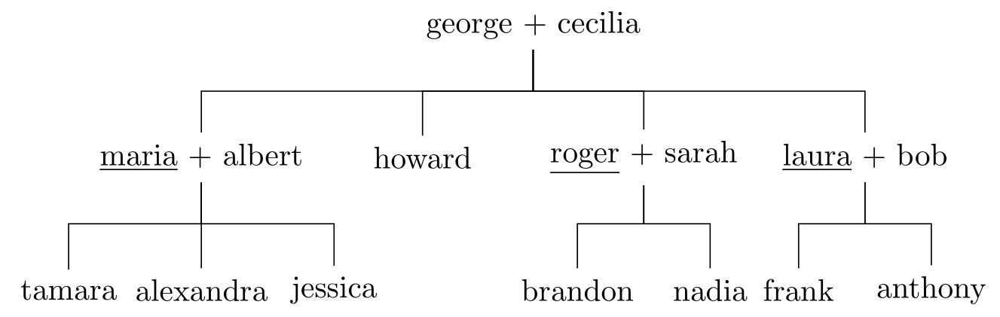

# Lab 1: Prolog 1

<!------------------------------------------------------------------------------
Inject in page to display URLs for printing / PDF generation.

a:after { content:" (" attr(href) ") "; font-size:0.8em; font-weight:normal; }
a.anchor:after { content:""; }
hr {border-top: solid 1px #eee !important; }

To enact page breaks:

<div style="page-break-before: always;"></div>

------------------------------------------------------------------------------->

## Installing Prolog

For these labs, we will use the SWI-Prolog distribution.

### macOS / OS X

Install [homebrew] then run `brew install swi-prolog`.
You can now run the Prolog shell from the command line with `swipl`.

**Important**: do not install from the official website, you will get crashes.

[homebrew]: http://brew.sh/

### Windows

Install from the [official website][windows-setup] (you need at least a
*typical* installation). Then run the prolog shell from the start menu.

[windows-setup]: http://www.swi-prolog.org/download/stable

### Linux

Install from your system package repositories (debian/ubuntu/mint: `swi-prolog`)
or follow [the instructions][linux-setup] from the official website. Run the
Prolog shell from the command line with `swipl`.

[linux-setup]: http://www.swi-prolog.org/build/unix.html

### Basic Navigation

If you're running `swipl` from the console on Linux or macOS, it's highly
recommended to install `rlwrap` (`brew install rlwrap`, `apt-get install
rlwrap`), and launch Prolog via `rlwrap swipl` — this will give the Prolog shell
the basic shell line-editing and history facilities that you're used to (e.g.
the up key to bring the last command).

At the shell, hitting `Ctrl-C` (twice for Unix) will bring up a menu with
option. You can use `e` to exit.

The current directory needs to be the directory where you keep your source
files. The first option is to run `swipl` there directly (Unix only).
Alternatively, you can input `cd("C:/Prolog")` (relative paths also work, tab
completion is available). `ls.` and `pwd.` (note the dot!) will work like the
shell `ls` and `pwd` commands.

If you need to change the current directory in your programs, use
`working_directory/2` instead.

<!----------------------------------------------------------------------------->
## Facts

Prolog operates over a *clause database*. There are two types of clauses:
*facts* and *rules*. Facts are statements which we know to be true. Here are few
example facts:

```prolog
prolog_is_simple.
life_is_beautiful.
father(george, maria).
male(george).
```

In these definitions, things like `prolog_is_simple`, `father`or `maria` are
called *terms*. But `father(george, maria)` is also a term. Almost everything in
Prolog is a term, but the addition of a dot (`.`) turns the term into a fact (or
rule, see later).

Simple terms like `prolog_is_simple` or `george` are called *atoms*. The third
and fourth lines exhibits complex terms (or *structures*). The facts on these
lines tell us about terms or relations between terms: i.e. George is Maria's
father and George is a male. In these terms, the thing before the parentheses is
called the *predicate*. Predicate are often designated by their name followed
their number of parameters (because overloading on the number of parameters is
allowed): `father/2` and `male/1` for our exemple.

For now, facts must be defined in a file. Later we will see how we
*sometimes* can define new facts using the prolog shell.

To load facts defined in a file, use the `consult/1` predicate. The
course website holds such a file, named `family.pl`. Load it in one of
the following ways, assuming the current directory contains the file:

```prolog
?- consult("family.pl").
?- consult(family).
?- ["family.pl"].
?- [family].
```

The `?-` sigil denotes the prolog shell. This shell can be used to load
definitions from files and formulate queries over the database. As we will see
later, **queries and facts are not the same thing**.

In the rest of this lab, you will have to write both definitions (facts and
rules) as well as queries. We suggest that you create a file to enter all your
definitions (e.g. `definitions.pl`), and that you record all your queries in a
**separate** file. Load this file (`definition.pl`) like the `family.pl` file
above. Whenever you add a new definition to your file or change an existing
definition, you can reload it by running the `make/0` predicate:

```prolog
?- make.
```

The `family.pl` file defines a set of facts that is equivalent to the
following family tree:



---
**Exercise `[facts]`**

Try to write some facts about our family tree in terms of `father/2` and
`mother/2`:

- Maria is Alexandra's mother.
- Roger is Nadia's father.
- Laura is Anthony's mother.

Do not write these facts to your file as they would conflict with the defintions
inside `family.pl`.

---

<div style="page-break-before: always;"></div>

<!----------------------------------------------------------------------------->
## Logical Variables and Unification

In Prolog, objects starting with a capital letter are *logical variables*. These
are not variables in the sense of most programming languages: they are not a
label to some place to store data, but rather placeholders for values which are
not yet known, like mathematical variables. Once their value is learned, it will
not change within a clause (excepted when backtracking, as we'll see later). A
variable can be either free, bound to a term (`X = 5.`) or aliased to another
variable (`X = Y.`).

Prolog uses unification, and advanced kind of pattern matching to define
equality. For instance:

```prolog
?- X = X.
true.

?- 9 + 5 = 14.
false.

?- father(george, maria) = father(george, maria).
true.

?- father(george, maria) = father(george, howard).
false.
```

No evaluation is performed on the members, they are simply defined as equals if
their structures match. Prolog can also *unify* terms: two terms can be unified
if it possible to instantiate their variables in a way that both terms are
equal. For example:

```prolog
?- father(X,maria) = father(george, Y).
X = george,
Y = maria.
```

The terms `father(X, maria)` *unifies* with `father(george, Y)` when `X =
george` and `Y = maria`.

The "result" of unification is thus a set of bindings for the variables that
were unified.

<div style="page-break-before: always;"></div>

<!----------------------------------------------------------------------------->
## Queries

Once you have fed Prolog some facts, you can start making queries. For instance:

```prolog
?- father(george, maria).
true.
```

Queries are not limited to yes-or-no answers. 
For instance, if you wish to know who is Maria's father:

```prolog
?- father(Who, maria).
Who = george.
```

All the commands containing `=` in the previous section on unification were
queries (`=` is in fact a predicate with a special syntax. `X = 1.` can also be
written `=(X, 1).`.

Sometimes, queries are also called *goals* especially when they contain no
variables. *Goal* also refers to any predicate instantiation that we are trying
to prove is true during the execution of a prolog program.

In Prolog a comma `,` denotes a logical *and* whereas a semi-colon `;` denotes a
logical *or*. Note that like in most programming languages, *and* binds more
tightly than *or*, hence `false, true ; true.` is the same as `(false, true) ;
true.`

For instance, here is a query for all people who are male or are the children of
George:

```prolog
?- male(Who) ; father(george, Who).
```

In this case there are many possible answers. You can use the space key to
obtain more results and the return key to stop getting results. Prolog has
multiple useful built-in predicates to handle these cases, like the `findall/3`,
`bagof/3` and `setof/3` and `forall/2` predicates.

The `findall/3` predicate will unify its third parameter with a list of possible
value for its first parameter, given that the second parameter is satisfied For
instance (notice the repetitions):

```prolog
?- findall(Father, father(Father, X), List).
List = [george, george, george, george, albert, albert, albert, roger, roger|...].
```

---
**Exercise `[bags]`**

 What are the two differences between the `findall/3` and the `bagof/3`
predicate? You can use the `help/1` predicate to get help about other
predicates: e.g. `help(findall/3).` or even `help(findall)`.

Use `bagof/3` to write a query that returns the same result as
`findall(Father, father(Father, X), List).`.

Hint: you will need some special syntax mentionned in the help.
  
---

The `setof/3` predicates works like `bagof/3` but
eliminates duplicates from the result list.

The `forall/2` predicat does not provide the list of items the
satisfy a query, but rather checks whether all items matching the first query
can satisfy the second query:

```prolog
  ?- forall(father(albert, X), mother(maria, X)).
  true.
```

The above query will tell you whether all people who have Albert as father, also
have Maria as mother.

---
**Exercise `[queries]`**

Write some queries to :

- know if George is the father of Tamara.
- know if Anita is the mother of Brandon.
- get all the children of Maria.
- get all the sons of Roger.
- check that Maria and Albert only have children together.
- check that all fathers are male and all mothers are female.

---

<!----------------------------------------------------------------------------->
## Rules

The second type of clauses are *rules*. Rules allow to use known facts to draw
conclusions from the database. For instance:

```prolog
male(george).             % this is a fact
human(X) :- male(X).      % this is a rule: if X is a male, X is human
```

With that database, the query `human(george).` would return `true`.

The distinction between facts and rules is somewhat artificial: a fact
`male(george).` can be written as a rule `male(george) :- true.`. Conversely,
the *turnstile* (`:-`) is a predicate and `human(X) :- male(X).` can be written
`:-(human(X), male(X)).`.

We also note that we can have rules without turnstiles: `unify(X, X).` is a rule
defining a predicate which only succeeds if its two parameters unify. You can
also see why it is important to distinguish between queries and clauses, as the
same syntax can denote both a query or a rule.

Finally, we note that multiple rules may contribute to the definition of the
same predicate.  
So `human(X) :- man(X) ; female(X).` is equivalent to

```prolog
human(X) :- man(X).
human(X) :- female(X).
```


---
**Exercise `[rules]`**

Write rules to describe the following relationships:

- `parent(Parent, Child)`
- `son(Son, Parent)`
- `daughter(Daughter, Parent)`
- `grandfather(Grandfather, Grandchild)`
- `grandparent(Grandparent, Grandchild)`
- `sibling(Sibling1, Sibling2)`
- `brother(Brother, Sibling)`
- `have_children_together(Person1, Person2)`
- `uncle(Uncle, Person)`

Pay attention to the details. For instance, we do not want for someone to be
their own brother. Similarly, the order of the arguments of
`have_children_together/2` shouldn't matter.

---
**Exercise `[ancestor]`**

It is possible (and often useful) to write recursive rules: rules which reduce
the deduction to a base case. 

Consider the following definition:
  

  
> Someone is an ancestor of someone else if they are their direct parent, of if
they are the direct parent of one of their ancestors.

Write a rule defining the `ancestor/2` predicate according to the definition.

Beware that the base case of the recursion must be specified first, or the logic
engine may enter an endless loop (we will cover the reasons for this next week).

---

<!----------------------------------------------------------------------------->
## Anonymous Variables

The underscore character can be used instead of variables when we are not
interested in their value. This underscore behaves like a regular variable, each
of its uses will be treated as a different variable.

Under the hood, each use of `_` will be bound to a distinct fresh variable,
using names such as `_1`, `_2`, ...

---
**Exercise `[underscore]`**

Use the underscore wildcard to:

  
- determine whether Laura has at least one child.
- add a `human/1` predicate so that *everyone* is a human.
- define a `is_sibling/1` predicate that checks whether a
  person as at least one sibling.

---
**Exercise `[merge]`**

Consider the following query:

```prolog
findall(Parent, parent(Parent, Child), List).
```

Define a new rule that will help you formulate a query giving the same result,
but using `bagof/3` instead, and without using the `^` predicate.

---

<!----------------------------------------------------------------------------->
## Pattern Matching

Complex terms may appear as parameters to predicates, both in facts and rules:

```prolog
married(couple(george, cecilia)).
heterosexual(couple(X, Y)) :- male(X), female(Y) ; female(X) , male(Y).
```

as well as in queries:

```prolog
?- married(couple(george, X))
X = cecilia.

?- married(X)
X = couple(george, cecilia).
```

When a complex term appears as parameter to a predicate, the part before the
parentheses is called *functor* (this does not have the same meaning as in some
functional programming languages). In the examples above, `couple` is a functor.

When they appear on the left-hand side of a rule (or in a rule without
turnstile), complex parameters behave like an additional unification
constraints, so our `heterosexual/1` rule above is in fact equivalent to:

```prolog
heterosexual(Couple) :-
    Couple = couple(X, Y) ,
    (male(X), female(Y) ; female(X) , male(Y)).
```

Pattern matching enables us to do some interesting things:

```prolog
swap(couple(X, Y), couple(Y, X)).
```

```prolog
?- swap(couple(george, cecilia), R).
R = couple(cecilia, george).
```

As we will soon see, pattern matching is particularly handy when dealing with
lists.

<!----------------------------------------------------------------------------->
## Lists

Prolog has a builtin list data structure. They are denoted by square brackets:
`[a,b,c,d]`.


Lists are composed of a head and a tail, which is itself a list. To match the
head and the tail of the list, you can use the bar operator: `[Head|Tail]`.

The empty list `[]` forms the base case, a list `[a, b, c]` can also be written
as `[a|[b|[c|[]]]]`, or even as `[a, b | [c]]` for instance.

Below is an example of a predicate operating over a list.  
It binds `R` to the last item in the list, and fails if the list is empty.

```prolog
last1([H], H).
last1([_|T], R) :- last1(T, R).
```

---
**Exercise `[lists]`**

Write Prolog clauses to:

- determine whether a value belongs to a list: `member1(Element, List)`.

- append two lists together `append1(List1, List2, Result)`.

- delete all occurences of a value in a list: `delete1(Element, List,
  Result)`.

- rotate all elements of a list to the left (so that the first element of the
  list will become its last element): `rotate_left(List, Result)`.

- rotate all elements of a list to the right (so that the last element of the
  list will become its first element): `rotate_right(List, Result)`.

1) Note: the `1` suffix is to avoid clashing with pre-defined prolog
predicates.  
2) Note: the symbol for non-unification is `\=`. You can also use the `\+` negation
predicate instead: `\+ X = Y`.  
3) Hint: you're allowed to define helper predicates! This is particularly useful
for `rotate_right/2`.

---
**Exercise `[guess]`**

Consider the following clauses:

```prolog
h([], []).
h([H|T], R) :- h(T, R1), append(R1, [H], R).
```


1. Try to guess the purpose of these clauses.
2. Try to execute `h([1,2,3], R).` by hand.
3. What is the complexity of this predicate? Can you formulate a better version
   of it with lower complexity?  
   Hint: use an accumulator.

---

<!----------------------------------------------------------------------------->
## Bonus Exercises

Write rules to:

1. give all permutations of a given list: `permutations(List, Permutations)`.
2. tell whether a list is a sublist of another: `sublist(Sublist, List)`.

Hint: start by defining a predicate `permutation1/2` which checks
if two lists are a permutation of one another.

Don't hesitate to ask for more hints if you need them.
