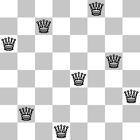

# Lab 2: Prolog 2

<!------------------------------------------------------------------------------
Inject in page to display URLs for printing / PDF generation.

a:after { content:" (" attr(href) ") "; font-size:0.8em; font-weight:normal; }

------------------------------------------------------------------------------->

## Numbers

We saw during the last lab that Prolog's unification is structural and that is
doesn't evaluate arithmetic expressions:

```prolog
?- 14 = 9 + 5.
false.
```

In fact, we now know exactly what `+` is: it's a functor.

There are Prolog predicates that treat their parameters specially: they are
*evaluated* to give meaning to some special functors, which are then treated
like functions (hence the name *functor*). The special predicates include `is`,
`=:=`, `=\=`, `<`, `=<`, etc. The special functors include `+`, `-`, `/`, `abs`,
...

For a full list and documentatiaon, run `apropos(arithmetic).` This will list
all predicates and manual sections which include the passed atom or string in
their description or title. You can then consult the appropriate page with
`help/1`. For manual sections, use something like `help(4-26-2).` (to consult the
list of general purpose arithmetic predicates on my SWI-Prolog installation).

Search for "General purpose arithmetic" to find the predicates, and "Arithmetic
Functions" to find the functors.

The `is/2` predicate is particularly important as it is what we will use to bind
variables to the result of an arithmetic operation:

```prolog
take(0, L, []).
take(N, [H|T], R) :- N1 is N-1, take(N1, T, R1), R = [H|R1].
```

---
**Exercise `[help]`**

Explain the difference between `is/2` and `=:=`.

---
**Exercise `[power]`**

Write a `power(X, N, R)` procedure to compute `R = X ^ N`. 

Try to execute different variations of `power`:

```prolog
power(7, 4, Z).
power(7, N, 2401).
power(X, 4, 2401).
power(7, 4, 2401).
power(7, 4, 1).
```

Do you understand why you obtain the observed behaviour?

---

<!----------------------------------------------------------------------------->
## Cuts

So far, we have talked about *what* Prolog does, but not yet about *how* it does
it. Essentially, when given a query, Prolog does a depth-first search for a
solution that satisfies the query. In this context, a solution means an
assignment of values to variables.

If we assume that no rules have disjunctions (`;`) in their bodies (remember
that disjunction can be translated to additonal clauses), then we can give a
rather simple explanation of Prolog's execution.

Given a goal, Prolog searches the database, from top to bottom, for clauses
whose head match the goal. When it finds one, it then tries to satisfies its
sub-goals (the goals in the body, separated by `,`) in the same fashion, from
left to right. If all sub-goals succeed, the goal succeeds.

Each time prolog selects a clause to match a goal, it records a choice point. If
at any point during the process we cannot satisfy a goal, we **backtrack** to
the latest choice point, and try to find another clause that can match the goal
associated to the choice point. If we cannot find any, that goal fails.

Prolog provides a *cut operator* (`!`) to control backtracking.

The cut operator is a predicate that always succeeds. A cut operator is
associated to a choice point (that is, the rule or disjunction in which it
appears). The cut operator specifies that, after encountering it, no
backtracking should be performed for the choice point associated with it, nor
for any choice point encountered since. Let's take an example:

```prolog
f(X) :- g(X), !, h(X).
f(X) :- z(X).
```

Here, the cut operator says that, if `h(X)` cannot be satisfied, we should not
backtrack on `f(X)`, nor on any choice that might occur within `g(X)`. In this
case this means that the rule `f(X) :- z(X)` can only be matched when `g(X)`
fails (causing the cut operator not to be encountered). However, note we are
able to backtrack to any choice point within `h(X)`.

If you are interested in the fine print of prolog's semantics, please refer to
the [Prolog Syntax and Semantics][semantics] presentation (also available on
Moodle).

[semantics]: https://sewiki.iai.uni-bonn.de/_media/teaching/lectures/alp/2011/slides/02-syntax_and_semantics-v6.pdf

---
**Exercise `[cuts]`**

Suppose we have the following database:

```prolog
p(1).
p(2) :- !.
p(3).
```

Write all of Prolog’s answers to the following queries:

```prolog
?- p(X).
?- p(X), p(Y).
?- p(X), ! ,p(Y). 
```

This exercise was lifted from the *Learn Prolog Now* online textbook.

---
**Exercise `[negation]`**

Implement a `neg/1` predicate that suceeds only if its operand cannot be
satisfied, using the cut operator and the `fail/0` predicate (always fail). Do
not use the builtin negation operator (`\+`).


---
**Exercise `[if]`**

Implement an `if1(Cond, If, Else)` predicate which tries to satisfy `If` only if
`Cond` can be satisfied, and tries to satisfy `Else` only if `Cond` cannot be
sataisfied. Your solution does not need to backtrack over `Cond`.

The operator you implemented corresponds to the built-in `->` predicate (do
**not** consult the help, as it contains the solution to the exercise).

---

### Debugging

You can debug your programs at the prompt by typing `trace.`. This will enter a
trace mode where queries will execute one step at a time. This mode will
indicate when the interpreter attempt to satisfy a goal (`call`), when it
backtracks (`redo`), when a goal succeeds (`exit`) or fails (`fail`). Type
`nodebug.` to exit trace mode.

Refer to the presentation linked above for more details (slide 87).

### Green Cuts vs Red Cuts

You can use cuts in two ways.

- Cuts that do not change the meaning of the program (the solutions are the same
  with or without the cuts) are called *green cuts*. These cuts improve
  performance by avoiding unnecessary backtracking.
  
- Cuts that do change the meaning of the program are called *red cuts*. You
  should avoid red cuts as they make it harder to reason about Prolog programs.
  Most legimate uses of red cuts are subsumed by the use of the negation and
  conditonal operators (`\+` and `->`), so use those instead.
  
When to use green cuts? When you know that backtracking cannot yield further
valid solution if a certain condition has been met. Here is a toy example:

```prolog
max(A, B, R) :- A >= B, !, R = A.
max(A, B, R) :- A < B, R = B.
```

This sets `R` to the maximum amongst `A` and `B`.

By inserting a cut after `A >= B`, we ensure that the program won't backtrack to
the other clause, which cannot possibly succeed.

The performance gain here is negligible, but this kind of optimization makes
sense in cases where the condition preceding the cut is expensive to compute.

We could optimize further with a red cut:

```prolog
max(A, B, R) :- A >= B, !, R = A.
max(A, B, R) :- R = B.
```

This program has the same semantics as our previous program, but does not have
the same semantics if we remove the cut. Again, the performance gain is
negligible but it can make sense given an expensive condition. We could also use
`->` instead:

```prolog
max(A, B, R) :- A >= B -> R = A ; R = B.
```

---
**Exercise `[reverse]`**

In the last lab session, you had to guess that an anonymous predicate's purpose
was to reverse a list. You also had to implement a better version of it with an
accumulator.

Using these implementations (let's call them `reverse1` and `reverse2`), try
inversing the regular parameter order: `reverse1(L, [1, 2, 3])` and `reverse2(L,
[1, 2, 3])`.

The expected behaviour is that the correct answer is supplied but then the
interpreter enters an infinite loop instead of detecting there aren't any other
valid solutions?

1. Explain this behaviour.

2. Use a cut to prevent the infinite search.

3. Is this a green cut or a red cut?
   After answering the question, try the query `reverse2(L, [1, 2 | T])`.
   Does your new implementation behave similarly?
   
4. Investigate the implementation of the standard `reverse/2` predicate using
   the `listing(reverse).` query. Do you understand how it works? What is the
   key insight compared to solutions that loop infinitely?

---

<!----------------------------------------------------------------------------->
## Database Manipulation

So far, we could only define clauses in a file, which we reloaded at the
prompt with `make/0`. However there exist predicates to add facts and rules
dynamically, as part of a query.

These predicates should not be used to reload programs (`make/0` is much more
efficient), however we can use them to enable caching, or emulate hash table or
hash sets.

To be able to use these predicates, the predicates to which we will add/remove
clauses must be marked as *dynamic* in your definition file:

```prolog
:- dynamic brother/2.
brother(joe, william).
```

You can now add clauses at the prompt:

    ?- asserta(brother(joe, jack)).
    ?- assertz(brother(joe, averell)).

The difference between `asserta/1` and `assertz/1` is that `asserta` adds the
clause at the top of the database, while `assertz` adds it at the bottom. This
makes a difference when pattern matching is involved (recall that clauses are
matched from top to bottom).

If you made a mistake, you can use `retract/1` to remove a clause:
`retract(brother(joe, jack)).`

Finally, you can use `retractall/1` to remove all clauses whose head unify with
the parameter: `retractall(brother(X, Y)).` If you are writing a predicate that
uses caching, you should run this before reloading its definition with `make`.

---
**Exercise `[fibonacci]`**

Implement a Fibonacci predicate by simply applying the recursive definition:

    fib(n) =
        if (n = 0) or (n = 1)
            1
        if (n > 1)
            fib(n-2) + fib(n-1)
	
Use database manipulation to write a cached version of this predicate. Values of
the Fibonacci series should be added to the knowledge base after being computed.
	
This second version should be able to compute `fib(n)` for much larger values of
`n` (50000 for instance).

---


<!----------------------------------------------------------------------------->
## Meta-Interpreters

Prolog is a *homo-iconic* language. This means that the data uses the same
format as the code. We saw this in the last lab when we noticed the similarity
between predicates and functors.

Homo-iconicity makes it easy to write code that manipulates language constructs.
Consider for instance the following interpreter:

```prolog
solve(true)     :- !.
solve(\+ A)     :- !, \+ solve(A).
solve((A, B))   :- !, solve(A), solve(B).
solve((A; B))   :- !, solve(A); solve(B).
solve(A)        :- clause(A, B), solve(B).
```

`solve` takes as argument a goal and processes it according to Prolog's
semantics. This is a meta-interpreter: an interpeter for a language X written in
the language X itself.

---
**Exercise `[proofs]`**

Can you understand how this works? What does the `clause/2` predicate do? You
can try running `clause(power(0,0,1), Body).` to see what it does.
	
Try to modify the `solve/1` predicate into a `solve/2` predicate, where the
second parameter is used to return a *proof tree* for the goal given in first
parameter. For instance (re-load the `family.pl` file **for this lab**
beforehand):
	
```prolog
?- solve(grandparent(george,alexandra), Proof).
Proof = (grandparent(george, alexandra) :- 
  (parent(george, maria) :- 
      (father(george, maria) :- true)),
  (parent(maria, alexandra) :- 
      (mother(maria, alexandra) :- true))).
```

---

A small notes on the cuts used. The cut on `true` prevents backtracking to try
`clause(true, B)`, which results in an error because the definition of `true` (a
primitive) is private. The role of the other cuts is similar, for instance we
have that `clause((X, Y), B) :- B = call((X, Y))` (i.e. `clause` matches the
built-in rule for the `,` predicate!) and that would cause infinite
backtracking.

This meta-interpreter can handle the basics of Prolog but cannot understand
special operators, like `=` or `>`. It is possible to write more advanced
meta-interpreters handling these cases. For reference: section 3.8
in [Simply Logical: Intelligent Reasoning by Example][simply-logical].

[simply-logical]: https://www.cs.bris.ac.uk/~flach/SL/SL.pdf

<!----------------------------------------------------------------------------->
## Eight Queens

The eight queens problem is a famous puzzle where, given a standard 8x8
chessboard, you have to place 8 queens such that no queen can attack another. If
you're not familiar with chess, this means no two queens can be on the same row,
column, or diagonal. Here is an example solution:

<p align='center'></p>

---
**Exercise `[8queens]`**

Your task is to solve the 8 queens problem in Prolog.

We will represent board configurations as follows:

    [1/3, 2/7, 3/2, 4/8, 5/5, 6/1, 7/4, 8/6]

This is a Prolog representation of the solution above. Here, `/` is simply a
functor. More generally, a proper board configuration satisfies these
properties:

- It is an array of 8 elements.

- Each elements matches the `X/Y` pattern.

- `X` and `Y` are integers in the 1-8 range.

- As an additional constraint, we fix the `X` indices to be 1, 2, ... 8. So the
  board will look like `[1/Y1, 2/Y2, 3/Y3, 4/Y4, 5/Y5, 6/Y6, 7/Y7, 8/Y8]`. If we
  do not do this, the approach proposed below would be too slow.

Proceed following these steps:

1. Write a `board/1` predicate that checks if a value is proper board
   configuration (but not necessarily a solution). This predicate can then be
   used to enumerate all possible board configuration. 
   
2. Write a `notattack/2` predicate that checks that two queens cannot attack
   each other.
   
3. Write a `safe/1` predicate that takes a board as a parameter and verifies
   that no queen can attack another.
   
4. Write a query that enumerates all solutions to the problem.

You can use library functions if you want to.

Bonus exercise: how to improve the performance of this implementation?
Specifically, we would like to avoid generating all possible configurations and
check the safety of a queen directly when selecting its position. Ask for hints
if required.

---
